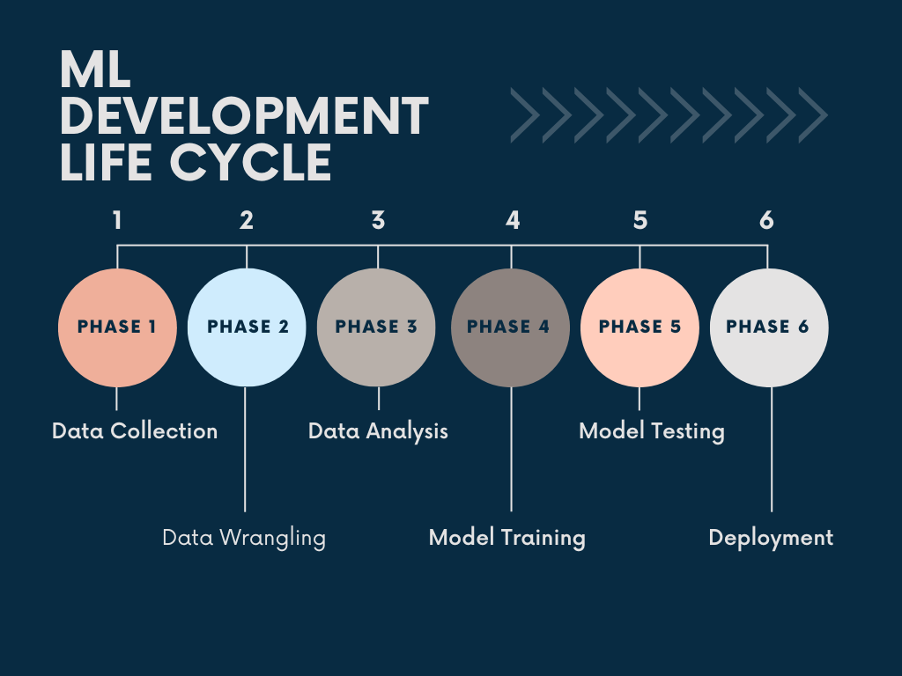

# Real Estate House Price Predictor
This ipython notebook is working to build a model which will predict the house price based on some features, identify the features that affects the house’s price and carry out evaluation matrices.  
The dataset used has been taken from:  <a href="https://www.kaggle.com/datasets/shrikrishnaparab/housing-datafile">Kaggle: housing_datafile</a>  
You can follow the analysis on <a href="https://www.kaggle.com/code/shrikrishnaparab/real-estate-house-price-predictor">kaggle</a>

## Packeges Used:
 ![Python][python] ![scikit-learn][sklearn-image] ![Pandas][Pandas-image]  ![Jupyter Notebook][ipython-image] ![Matplotlib][Matplotlib-image] ![Plotly][Plotly-image]
 
[python]: https://img.shields.io/badge/python-3670A0?style=for-the-badge&logo=python&logoColor=ffdd54
[sklearn-image]:https://img.shields.io/badge/scikit--learn-%23F7931E.svg?style=for-the-badge&logo=scikit-learn&logoColor=white
[Pandas-image]: https://img.shields.io/badge/pandas-%23150458.svg?style=for-the-badge&logo=pandas&logoColor=white
[ipython-image]: https://img.shields.io/badge/jupyter-%23FA0F00.svg?style=for-the-badge&logo=jupyter&logoColor=white
[Matplotlib-image]: https://img.shields.io/badge/Matplotlib-%23ffffff.svg?style=for-the-badge&logo=Matplotlib&logoColor=black
[Plotly-image]: https://img.shields.io/badge/Plotly-%233F4F75.svg?style=for-the-badge&logo=plotly&logoColor=white

## Process:

The Problem Statement: identify the features that affects the house’s price, build a model which will predict the house price based on some features, test the model, carry out evaluation matrices, Evaluate the model.   
The ML Lifecycle Process can be used to build app architecture for our problem statement  
    - EDA : understand the data  
    - Feature Creation  
    - Data Cleaning  
    - Data Scaling  
    - Create Pipeline  
    - Train Model  
    - Test Model(Evaluation):  
        1. MSE
        2. RMSE
        3. Cross-Validation
    - Dump the model  
    - Use the model to do predictions  
    - Deployment
## RandomForestRegressor
RandomForestRegressor is a machine learning algorithm that is part of the Random Forest ensemble method. It is used for regression problems, where the goal is to predict a continuous numerical value. The algorithm creates multiple decision trees (hence the name "forest") and combines their predictions to make a final prediction. The combination of multiple decision trees helps to reduce overfitting and improve the overall performance of the model. It is implemented in scikit-learn library, and it can be used by importing the RandomForestRegressor class from the sklearn.ensemble module.
